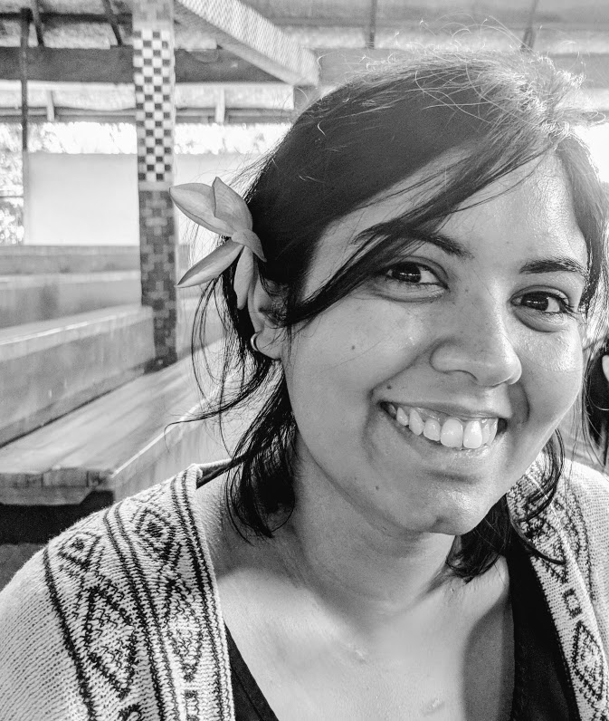

I am pursuing a PhD in Cognitive Science at the [NeuroBioPsychology Lab](https://www.ikw.uni-osnabrueck.de/en/research_groups/neurobiopsychology.html) at [The Institute of Cognitive Science](https://www.ikw.uni-osnabrueck.de/en/home.html). I am interested in studying human oculo-motor behavior in naturalistic environments. I work with mobile eye-trackers in virtual reality.

 
 
 
 
 
 
 

##### Attributions:
- Blog theme called <a href="https://github.com/fongandrew/hydeout">Hydeout by Andrew Fong</a>
- Icons by <a href="https://www.flaticon.com/authors/darius-dan" title="Darius Dan">Darius Dan</a> from <a href="https://www.flaticon.com/" title="Flaticon">www.flaticon.com</a>
