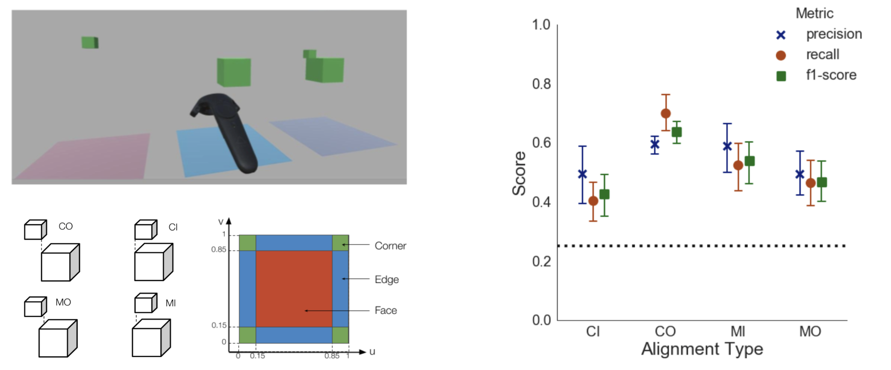
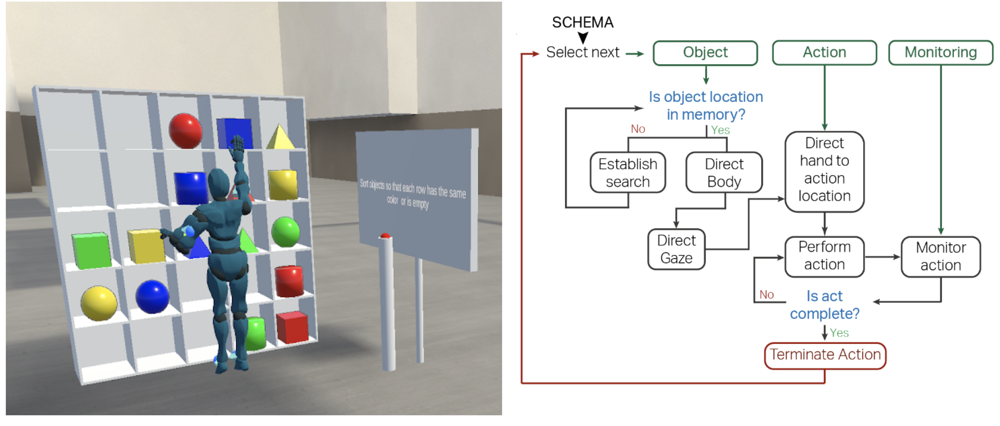
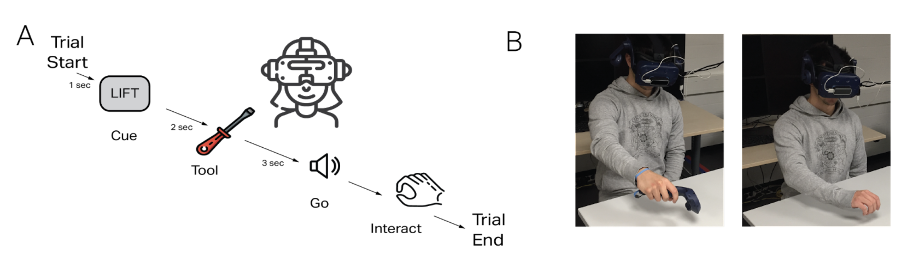
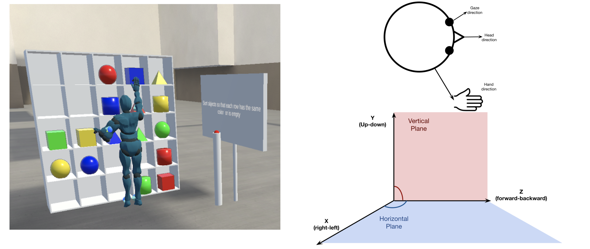
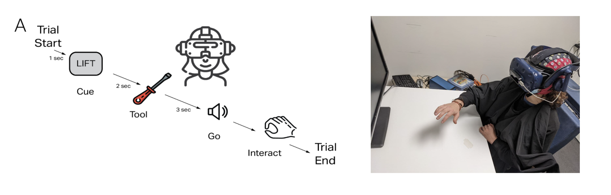

During my PhD I worked on the question: _How do eye movements plan and guide actions in the natural world?_

To answer the above, I asked five smaller questions.

### Q1: Can gaze behavior identify the task performed by the user?

Here, we used simple gaze features such as proportion of fixations on regions of interest to classify a simple pick and place task performed by the user. We used SVMs with leave-one-subject out cross validation method to predict the task performed. Our results show that even simple gaze features are a robust signal and can successfully decode a user’s task.
 

<a href="http://dx.doi.org/10.1145/3379156.3391338">  Paper  </a>

 
 
### Q2: How does gaze support a sequence of actions?

 Eye movements in the natural environment have primarily been studied for over-learned and habitual everyday activities (tea-making, sandwich-making, hand-washing) which have a fixed sequence of actions associated with them. These studies typically categorize eye movements related to low level action plans of locating the object of interest, directing the body or hand to the object, and monitoring the action execution. In this study, we were interested in generalizing these task-oriented eye movements for novel tasks that are not associated with an inherent action sequence. To that end, we asked subjects to sort objects based on object features on a life-size shelf in a virtual environment as we recorded their eye and body movements.
  

<a href="https://www.biorxiv.org/content/10.1101/2021.01.29.428782v3">  Paper  </a>

<a href="https://github.com/ashimakeshava/ergovr_gaze_guidance">  Code  </a>

  
  
### Q3: What are the spatial biases in gaze behavior while interacting with tools?

Here we investigated active inference processes revealed by eye movements during interaction with familiar and novel tools with two levels of realism of the action affordance. We presented participants with 3D tool models that were either familiar or unfamiliar, oriented congruent or incongruent to their handedness, and asked participants to interact with them by lifting or using. Importantly, we used the same experimental design in two setups. In the first experiment, participants interacted with a VR controller; in the second, they performed the task with an interaction setup that allowed differentiated hand and finger movements. We investigated the differences in odds of fixations and their eccentricity towards the tool parts before action initiation.

<a href="https://www.biorxiv.org/content/10.1101/2021.07.27.454022v2">  Paper  </a>

<a href="https://github.com/ashimakeshava/gaze_tool_interaction">  Code  </a>

 
 

### Q4: How do eyes and hand coordinate to plan actions?

Studies of eye-hand coordination are primarily conducted for sedentary tasks that do not require full-body movements. These tasks have shown that eye fixations precede manual action by ~1 second. However, we do not yet know how eyes and hands might coordinate in a larger spatial context where action locations vary and require coordination in different rotational planes.
 
`in prep`
 

### Q5: What is the neural basis of anticipatory gaze behavior?

Here, we use Generalized Eigen Decomposition to find the neural sources that are involved in active inference processes that lead to anticipatory gaze behavior.
`project ongoing`
